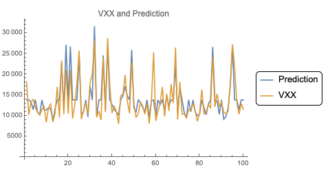
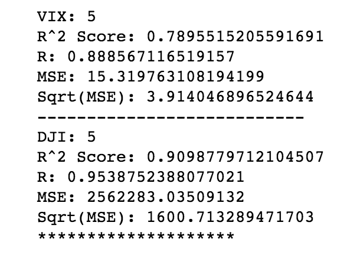

# DJI-VXX
This project creates a machine-learning model to predict the volatility index and the Dow Jones Industrial Average based on Wall Street Journal headlines.

The model was created by reading the top headlines in the WSJ from the past 20 years and correlating it with the Dow Jones Industrial Average as well as the Volatility Index. Using  tf-idf scores I was able to quantify the meaning of the headlines and relate them to the stock prices. After creating theses scores, I used a Kernel Ridge model that, when given 5 consecutive days of headlines, it would predict the Dow Jones Industrial Average and Volatility index for the follow day.

Demonstrations currently under construction.
          VXX Prediction Graph    |               Data Results
:--------------------------------:|:--------------------------------------:
| 
